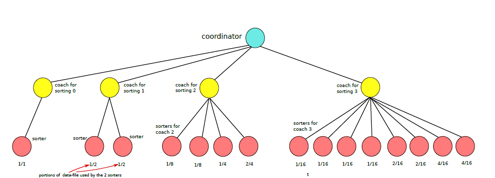

# Sorting-Assignment
Multiple sorts running at the same time as separate processes, utilizing fork and exec. Completed according to requirement for Operating Systems course.

## Installation 
From terminal, inside src folder run ```make```

## Explanatory Diagram


## Run Parameters
Program can be run as follows: ```./mysort -f inputfile -h|q columnid [-h|q columnid] firstinputs```

* ``` -f inputfile``` is the binary file with the data
* columnid``` is the column in which the sort will be done on 
* the ```-q``` or ```-h``` flag means that the sorters will either use Quick-Sort or Heap-Sort for their sorting process  
* ```firstinputs``` will have to be a number repressenting the first inputs of the binary file that the sort will take place

## Authors

Alex Karvounis - [al3xkarv](https://github.com/al3xkarv)

## License

This project is licensed under the GNU General Public License v3.0
